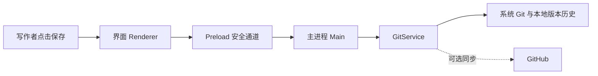

# ChronoDraft：从保存版本理解现有设计

记录日期：2026-09-22

对照源码：[ChronoDraft `288d658`](https://github.com/zhazhahuiyuxiaoxiao/chronodraft/tree/288d65823867342cd591b1536826cd7e9e8af9e7)

> 这是基于已有实现的学习复盘。我当时没有先系统比较架构或选定某个设计模式。下面的“为何合适”是根据现有实现做的分析，不代表当时已有这些决策记录，也不能证明其他方案一定更差。

## 1. 先看用户要完成什么

ChronoDraft 面向不想学习 Git 命令的写作者。选一条最重要的流程来看：修改一份文稿后保存一个可辨认的版本，以后能看到旧版并安全找回。项目的 [README](https://github.com/zhazhahuiyuxiaoxiao/chronodraft/blob/288d65823867342cd591b1536826cd7e9e8af9e7/README.md)把 GitHub 定位为可选备份；本地保存不应依赖云端连接。

我现在会把这条流程拆成可检查的结果：

| 情况 | 期望看到什么 | 当前证据 |
| --- | --- | --- |
| 文稿有改动、未连接 GitHub | 保存后能在本地历史找到这个版本 | [保存流程测试](https://github.com/zhazhahuiyuxiaoxiao/chronodraft/blob/288d65823867342cd591b1536826cd7e9e8af9e7/test/git-service.test.js#L194-L211)检查 `no-remote` 和本地历史 |
| 想恢复旧版，且还有未保存内容 | 先保留当前改动，再恢复目标版本 | [恢复流程测试](https://github.com/zhazhahuiyuxiaoxiao/chronodraft/blob/288d65823867342cd591b1536826cd7e9e8af9e7/test/git-service.test.js#L621-L640)检查“恢复前自动备份”和恢复结果 |
| 第一次使用界面 | 写作者能理解在哪里保存、查看和恢复 | 仍需真实新手试用；自动测试不能证明易用性 |

## 2. 代码如何完成这条流程

- **界面负责交互：**[保存按钮处理](https://github.com/zhazhahuiyuxiaoxiao/chronodraft/blob/288d65823867342cd591b1536826cd7e9e8af9e7/src/renderer/app.js#L1396-L1431)检查是否已填写作者信息，显示保存中和保存结果。它不直接执行 Git 命令。
- **Preload 是受限通道：**[公开给界面的接口](https://github.com/zhazhahuiyuxiaoxiao/chronodraft/blob/288d65823867342cd591b1536826cd7e9e8af9e7/src/preload.js#L20-L27)把保存和恢复请求转成指定的 IPC 消息。
- **主进程分发操作：**[IPC 处理](https://github.com/zhazhahuiyuxiaoxiao/chronodraft/blob/288d65823867342cd591b1536826cd7e9e8af9e7/src/main.js#L223-L246)把消息交给当前项目的 GitService；[项目操作队列](https://github.com/zhazhahuiyuxiaoxiao/chronodraft/blob/288d65823867342cd591b1536826cd7e9e8af9e7/src/main.js#L95-L104)让它们依次执行。
- **GitService 处理版本：**[保存方法](https://github.com/zhazhahuiyuxiaoxiao/chronodraft/blob/288d65823867342cd591b1536826cd7e9e8af9e7/src/git-service.js#L1712-L1716)先 `commit`，再尝试 `sync`。[没有远端时](https://github.com/zhazhahuiyuxiaoxiao/chronodraft/blob/288d65823867342cd591b1536826cd7e9e8af9e7/src/git-service.js#L1393-L1402)返回“已保存在本机”。[恢复方法](https://github.com/zhazhahuiyuxiaoxiao/chronodraft/blob/288d65823867342cd591b1536826cd7e9e8af9e7/src/git-service.js#L1727-L1759)在存在未保存改动时先创建备份；恢复确实改变内容时，再生成一个新版本。

这让我理解“架构”在这个项目里具体是什么：**谁负责界面，谁能调用系统能力，版本记录由谁处理，数据先保存在哪里。**“Electron”“Git”是实现这些职责时采用的技术；“本地先保存、云端可选”是产品行为。它们不是同一个概念。

## 3. 现在能解释的理由，与还不知道的事

从现有代码看，桌面应用可以操作用户选定的本地文件夹；Renderer 和主进程通过 Preload 分隔；GitService 集中处理版本与同步。这些结构与“写作者在自己的电脑上保存作品”这一目标相符。这是**事后分析**，不是当时已经比较 Electron、其他桌面方案和不同版本存储方式的证据。

如果今天从零开始做，我会先写用户流程和“断网也能保存”的验收标准，再请 AI 比较满足这些条件的少量方案，解释系统权限、维护成本及失败路径。最后由我确认产品行为，而不是先要求 AI 套用某个架构名称。

## 4. 已验证与待验证

2026-09-22 在本机对上述源码运行 `npm run verify`：语法检查和 26 项自动测试通过，包括本地保存、旧版恢复等路径。这里没有重新安装发布包，也没有完成不熟悉 Git 的写作者独立试用。真人试用已暂缓，后续根据观察到的卡点决定是否改文案或交互；当前没有据此重构架构的证据。

这次学习的收获：**从真实需求追到代码和测试，再回头理解设计；把当时的经历与今天的理解分开记录。**
